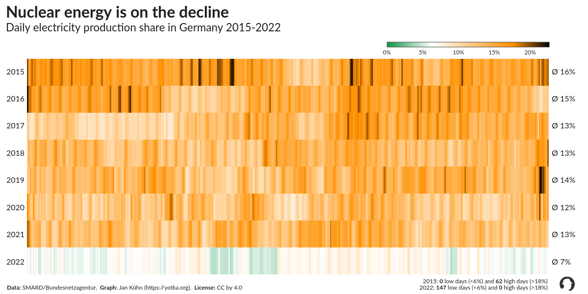
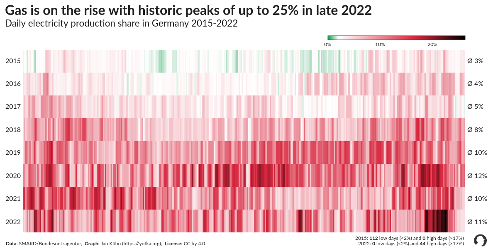

# Germany's (slow) transformation to renewable electricity
_A data visualisation project by [Jan Kühn](https://yotka.org), January 2023_

## What is this about?

For many years, German governments have pledged to leave fossil sources behind to generate electricity. The data shows that there have been some successes. But as the climate crisis worsens, electricity generation from fossil sources is on the rise again. This notebook explores data from 2015 to 2022 provided by [SMARD](https://www.smard.de/home/downloadcenter/download-marktdaten/), a service of the Federal Network Agency ([Bundesnetzagentur](https://www.bundesnetzagentur.de/)).

Read more about the analysis in an [article published at medium.com](https://yotka.medium.com/visualizing-germanys-slow-transformation-to-renewable-electricity-381289bed264).

The notebook can also be found on [Kaggle](https://www.kaggle.com/yotkadata/germany-s-transformation-to-renewable-electricity).

## Plots

  
  
  
  

  
  
  
  

  
  
  
  

  
  

## License

This work is licensed under a
[GNU General Public License v3.0](https://www.gnu.org/licenses/gpl-3.0).

## Thanks ...

... to [Nassos Stylianou](https://twitter.com/nassos_/status/1611300724184580096) (@nassosstylianou) and [Erwan Rivault](https://twitter.com/ErwanRivault) for the inspiration.
